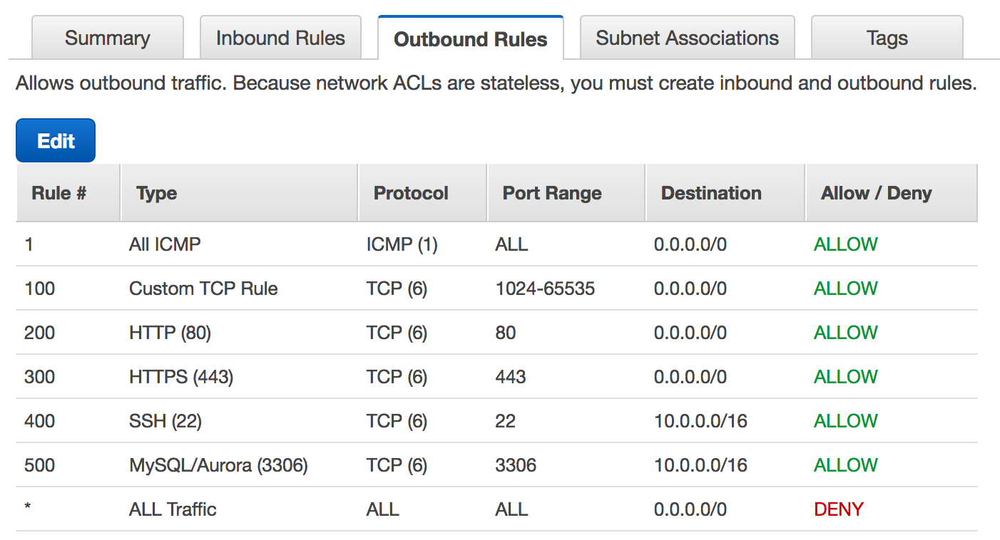

AWS VPC has multiple items that allows for control of traffic to and from various entities: namely Security-Groups, NACLs, Route-Tables, and WAF. This page is a compilation of information regarding them from various sources.
### Contents
- [Layout](#layout)
- [Security Group and NACL](#security-group-and-nacl)
  - [Some Notes](#some-notes)
- [Route Tables](#route-tables)
- [WAF](#waf)
- [References](#references)
## Layout

[Image Credits: Ashish Patel](https://medium.com/awesome-cloud/aws-difference-between-security-groups-and-network-acls-adc632ea29ae)

## Security Group and NACL
Both Security Group and NACL act as a firewall in AWS. Below is a comparison of these two.
||Security Group|NACL|
|-|-|-|
|**Action Realm**|Specific Instances or Load Balancers|Subnets|
|**Firewall Security Level**|2nd after NACL on ingress; Only traffic that pass through NACL get here|Before Security Groups on ingress; Opposite on Egress|
|**Reapplicablity**|Many instances can be assigned same SG; Multiple SG per instances allowed|Many subnets can have a unique copy of NACL; Only one NACL per subnet|
|**Stateful/Stateless**|Stateful; Any changes to income rule automatically applies to outgoing rule|Stateless; Any changes to incoming rules does not change the outgoing rule|
|**Rules: Allow or Deny**|*Allow Rules only*; Cannot deny certain IPs from establishing a connection|Support both Allow or Deny rules using explicit IPs|
|**Rule Process Order**|SG evaluates all rules before acting on traffic|NACL applies the action from the rules in order that is matched first|

The above table was summarized from a [medium post](https://medium.com/awesome-cloud/aws-difference-between-security-groups-and-network-acls-adc632ea29ae)

### Some Notes
* NACL can only allow/block packets based on IP and port. Since they are stateless, you MUST create rules to allow return traffic.
* SG can allow/disallow traffic based on either the IP address/port packets are coming from, or more interestingly, based on the security group attached to the instance the packets are coming from.

Security Rules Example

--------

------------

NACL Inbound and Outbound rules example

## Route Tables
Route Tables work as a route table in conventional routers. In conventional routers, route tables are used to direct traffic from router to hosts. 

Sample routes table from [Riverbed Guide](https://support.riverbed.com/bin/support/static/bk3e4nsvev67aokj3qg5gtcfv4/html/ulhrppo7aoojclf7jbgjnlji07/scm_dg_html/index.html#page/scm_dg_html/aws_cloud_topology.html)

## WAF
Web-Application Firewall work on Application Layer and can filter traffic based on countries.In AWS, WAF can attach to load balancers to do more complex types of filtering, like disallowing traffic from certain countries. AWS WAF lets you create rules to filter web traffic based on conditions that include IP addresses, HTTP headers and body, or custom URIs. WAF makes it easy to create rules that block common web exploits like SQL injection and cross site scripting.[5](https://aws.amazon.com/waf/features/)

AWS WAF in action

## References
1. [https://medium.com/awesome-cloud/aws-difference-between-security-groups-and-network-acls-adc632ea29ae](https://medium.com/awesome-cloud/aws-difference-between-security-groups-and-network-acls-adc632ea29ae)
2. [https://jayendrapatil.com/aws-vpc-security-group-vs-nacls/](https://jayendrapatil.com/aws-vpc-security-group-vs-nacls/)
3. [https://www.reddit.com/r/aws/comments/cab816/difference_between_security_groups_route_tables/](https://www.reddit.com/r/aws/comments/cab816/difference_between_security_groups_route_tables/)
4. [https://support.riverbed.com/bin/support/static/bk3e4nsvev67aokj3qg5gtcfv4/html/ulhrppo7aoojclf7jbgjnlji07/scm_dg_html/index.html#page/scm_dg_html/aws_cloud_topology.html](https://support.riverbed.com/bin/support/static/bk3e4nsvev67aokj3qg5gtcfv4/html/ulhrppo7aoojclf7jbgjnlji07/scm_dg_html/index.html#page/scm_dg_html/aws_cloud_topology.html)
5. [https://aws.amazon.com/waf/features/](https://aws.amazon.com/waf/features/)